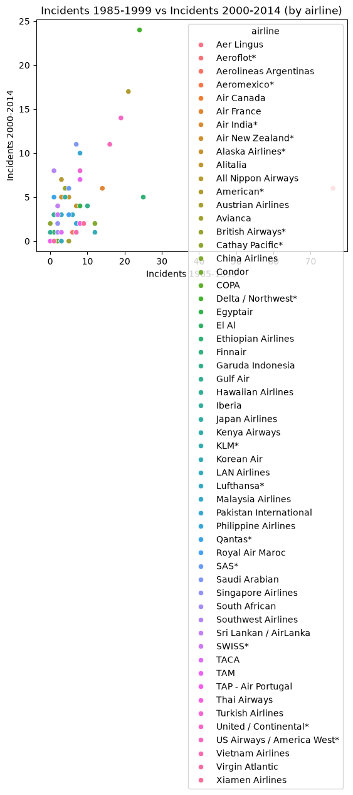
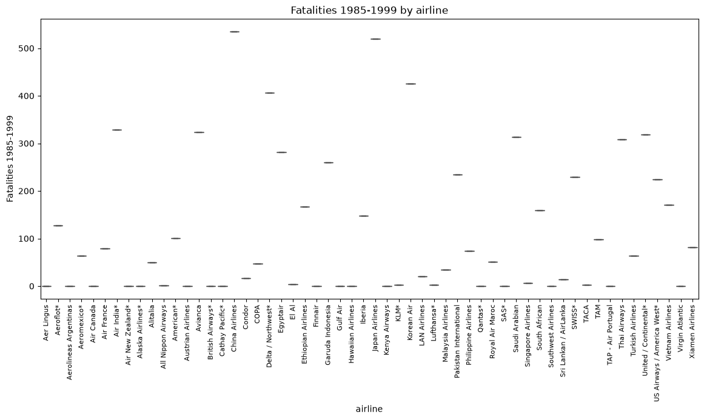

# Project Documentation

This site provides project documentation.
Use the documentation navigation to explore.

## How-To Guide

Many instructions are common to all our projects.

See
[⭐ **Workflow: Apply Example**](https://denisecase.github.io/pro-analytics-02/workflow-b-apply-example-project/)
to get these projects running on your machine.

## Project Documentation Pages (docs/)

- **Home** - this documentation landing page
- [**Project Instructions**](./project-instructions.md)  - the standard project workflow
- [**Your Files**](./your-files.md) - how to copy the example and create your version
- [**Glossary**](./glossary.md) - project terms and concepts
- [**API**](./api.md) - autogenerated code documentation for the public project interface

The API page is not always easy to read at first,
but it becomes useful as you get more comfortable with project structure,
modules, functions, and docstrings.
## Custom Project Modification

For Phase 4, I created a modified version of the example Python file called `app_aheid.py`.

I added an additional logging statement to improve observability and verify my modified project was running independently from the original example.

This helped me better understand how logging can be used to track execution and how small changes can safely modify a working project.

# Custom Project – Airline Safety Analysis

For my Phase 5 custom project, I selected a real-world dataset from FiveThirtyEight that examines airline safety records over time.

## Goal of the Project

The goal was to analyze airline incidents and fatalities and compare trends between two historical periods.

The project focused on the following questions:

- Which airlines had the highest number of incidents?
- How did airline safety change over time?
- Are earlier incidents related to later incidents?

## Visualizations

### Airline Incident Comparison

This scatter plot compares airline incidents during two different time periods.

### Airline Fatalities Distribution

This box plot compares fatalities across airlines.

## What I Learned

This project helped me better understand how to adapt an existing analytics workflow to a completely new dataset.

I learned how to:

- import a new CSV dataset
- choose variables for analysis
- modify Python code safely
- improve chart readability
- document results professionally
